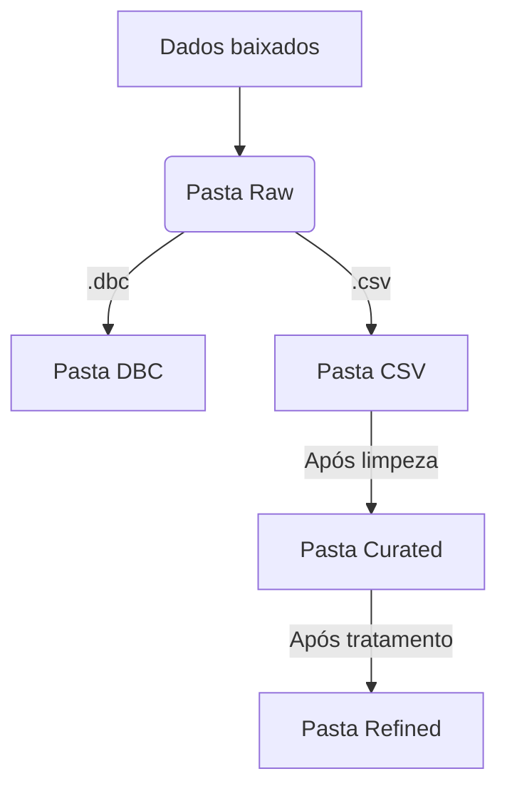

# IBTIsus

O pacote *IBTIsus* para o R tem a função de fazer o download dos arquivos do DataSUS e organizá-los em um Data Lake. Esse Data Lake será organizado em zonas lógicas dos dados, apresentando uma pasta para os dados brutos (Raw), uma para os dados limpos (Curated) e uma para os dados tratados (Refined).

Além disso, o pacote tem a opção de armazenar os dados brutos tanto em seu formato original (.dbc) quanto em formato .csv.

## Data Lake

# Instalação

    > install.packages("remotes")
    > remotes::install_github("IBTI-DF/SIGFAPDF/IBTIsus")

## Utilização
 O uso do pacote depende de, basicamente, uma única função: o pipeline automático de coleta e tratamento dos dados.

## Exemplo

    library(IBTI)
    pipeline(pasta = getwd(), periodo = 0)
Onde o argumento *pasta* é o diretório onde será criado o Data Lake (se não especificado, o Data Lake será criado no diretório vigente do R). E o argumento *periodo* é referente à data de atualização dos dados (nesse caso, ao se especificar uma data, a função só fará o download dos dados atualizados na data definida), ao não se definir uma data, será realizado o download de todos os dados do DataSUS.

## Dúvidas e sugestões

Qualquer dúvida, pode entrar em contato nos seguintes endereços de email:

> **matheus.souto@ibti.org.br**  
> **leonardo.miranda@ibti.org.br**  
> **victor.alencar@ibti.org.br** 
