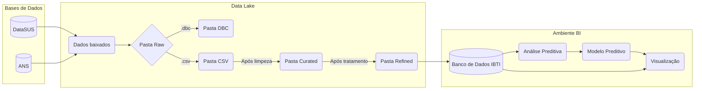

#  Projeto Saúde - IBTI

O [**Projeto Saúde**](link) é desenvolvido pelo IBTI e tem como objetivo principal implementar um ambiente de BI como serviços para apoio às atividades gerenciais da  Saúde Pública do GDF.

O projeto conta com um pacote na linguagem R chamado IBTIsus, onde é possível gerar um Data Lake automaticamente com todos os dados públicos do DataSUS organizados em diferentes zonas lógicas de armazenamento.

## Fluxograma

## Documentação

A documentação completa do projeto pode ser lida clicando [aqui](link).

## Guia do Usuário

Aprenda a visualizar os dados públicos do DataSUS seguindo o [guia do usuário](link), onde se encontra o tutorial de utilização do sistema.

## Funcionalidades do projeto
[**Filtragem dos dados:**](link)

[**Modelos de Previsão:**](link)

