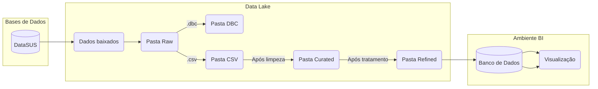

#  Projeto Saúde - IBTI

O [**Projeto Saúde**](link) é desenvolvido pelo IBTI e tem como objetivo principal implementar um ambiente de BI como serviços para apoio às atividades gerenciais da  Saúde Pública do GDF.

O projeto conta com um pacote na linguagem R chamado IBTIsus, onde é possível gerar um Data Lake automaticamente com todos os dados públicos do DataSUS organizados em diferentes zonas lógicas de armazenamento.

## Fluxograma

## Documentação

A Documentação Técnica e Guia do Usuárioi do projeto podem ser acessados clicando [aqui]([link](https://github.com/IBTI-DF/SIGFAPDF/blob/main/Documenta%C3%A7%C3%A3o%20T%C3%A9cnica%20-%20Projeto%20Sa%C3%BAde.pdf).
